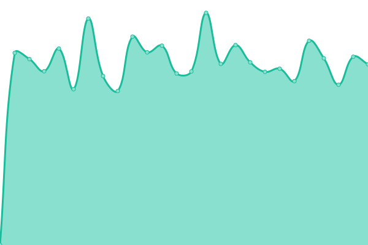
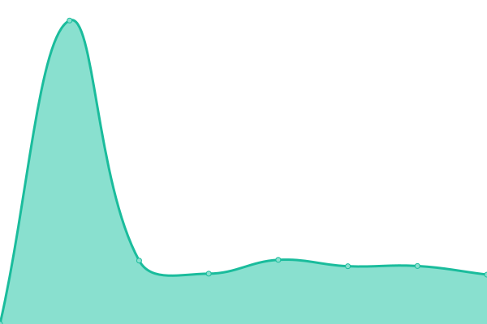
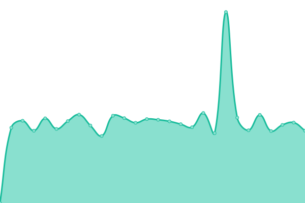
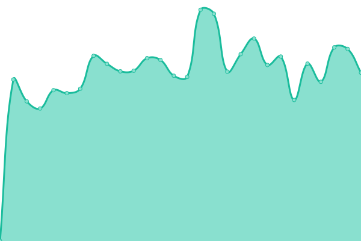
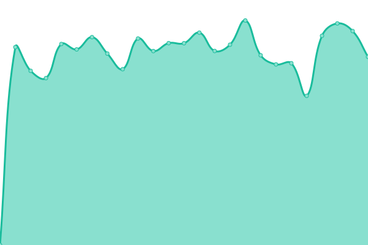

# [📈 Live Status](https://kasiaizak.github.io/upptime): <!--live status--> **🟧 Partial outage**

This repository contains the open-source uptime monitor and status page for [Kasia Izak](https://www.kasiaizak.pl), powered by [Upptime](https://github.com/upptime/upptime).

With [Upptime](https://upptime.js.org), you can get your own unlimited and free uptime monitor and status page, powered entirely by a GitHub repository. We use [Issues](https://github.com/kasiaizak/upptime/issues) as incident reports, [Actions](https://github.com/kasiaizak/upptime/actions) as uptime monitors, and [Pages](https://kasiaizak.github.io/upptime) for the status page.

<!--start: status pages-->
<!-- This summary is generated by Upptime (https://github.com/upptime/upptime) -->
<!-- Do not edit this manually, your changes will be overwritten -->
<!-- prettier-ignore -->
| URL | Status | History | Response Time | Uptime |
| --- | ------ | ------- | ------------- | ------ |
|  [iLabs](https://ilabs.dev/) | 🟥 Down | [i-labs.yml](https://github.com/kasiaizak/upptime/commits/HEAD/history/i-labs.yml) | 

 1848ms
     
 | 

<a href="https://kasiaizak.github.io/upptime/history/i-labs">88.62%</a>
    

|  [SiteCare](https://sitecare.pl/) | 🟩 Up | [site-care.yml](https://github.com/kasiaizak/upptime/commits/HEAD/history/site-care.yml) | 

 663ms
     
 | 

<a href="https://kasiaizak.github.io/upptime/history/site-care">100.00%</a>
    

|  [Floor is Lava](https://floorislava.dev/) | 🟥 Down | [floor-is-lava.yml](https://github.com/kasiaizak/upptime/commits/HEAD/history/floor-is-lava.yml) | 

 2263ms
     
 | 

<a href="https://kasiaizak.github.io/upptime/history/floor-is-lava">88.72%</a>
    

|  [Nestry](https://nestry.pl/) | 🟥 Down | [nestry.yml](https://github.com/kasiaizak/upptime/commits/HEAD/history/nestry.yml) | 

 2487ms
     
 | 

<a href="https://kasiaizak.github.io/upptime/history/nestry">88.96%</a>
    

|  [WoPloo](https://woploo.com/) | 🟥 Down | [wo-ploo.yml](https://github.com/kasiaizak/upptime/commits/HEAD/history/wo-ploo.yml) | 

 1881ms
     
 | 

<a href="https://kasiaizak.github.io/upptime/history/wo-ploo">89.06%</a>
    

<!--end: status pages-->

[**Visit our status website →**](https://kasiaizak.github.io/upptime)

## 📄 License

- Powered by: [Upptime](https://github.com/upptime/upptime)
- Code: [MIT](./LICENSE) © [Anand Chowdhary](https://anandchowdhary.com), supported by [Pabio](https://pabio.com)
- Data in the `./history` directory: [Open Database License](https://opendatacommons.org/licenses/odbl/1-0/)
